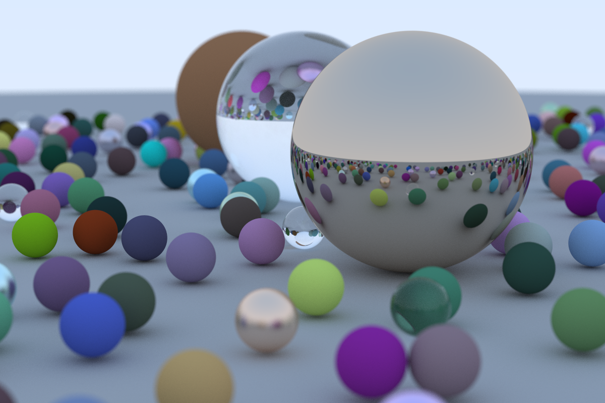

# raytracer

This is a straightforward Rust port of the [_Ray Tracing in One Weekend_][rotw]
raytracer.

It has several features the original lacks:

- Configurable options:

  ```
  -f, --scene-file  scene file
  -o, --output      output
  -a, --aspect-ratio
                    aspect ratio
  -w, --image-width image width
  -s, --samples-per-pixel
                    samples per pixel
  -d, --max-depth   max depth
  -D, --focus-distance
                    focus distance
  -A, --aperture    aperture
  -v, --vfov        vertical field-of-view
  ```

- Exporting renders as PNG rather than PPM
- A pretty progress bar
- Built around `nalgebra::Vector3<f64>` rather than rolling our own vector code.
- Rendering arbitrary scenes using scene files (like [`scene.dhall`][scene]).

# The cover render

The cover render, described in [`scene.dhall`][scene], with
`-a 1.5 -w 1200 -s 500 -D 10 -A 0.1` (the parameters from the chapter "A Final
Render" in the book) takes about 52 minutes to render on my 2018 i7 MacBook Pro.



The final render _as it appears in the book's source code_, with an aspect ratio
of 16:9 and 10 samples per ray takes about a minute to render. The original C++
version takes about 7 minutes to render a similar scene.

[rotw]: https://raytracing.github.io/books/RayTracingInOneWeekend.html
[scene]: ./scene.dhall
