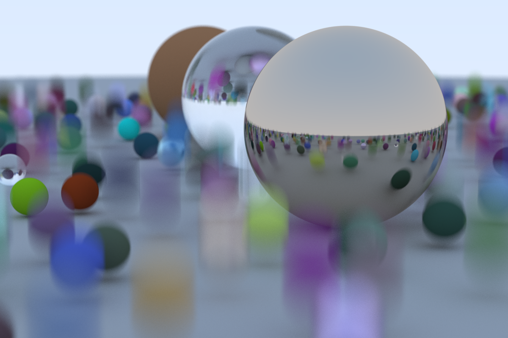

# raytracer

This is a straightforward Rust port of the [_Ray Tracing in One Weekend_][rotw]
raytracer.

# The final cover render

The final cover render, with 500 samples per ray, took almost 2.5 hours to
render on my 2018 i7 MacBook Pro.

The final render as it appears in the book's source code, with an aspect ratio
of 16:9 and 50 samples per ray takes about 11 minutes to render.

This is still slower than the C++ version, which takes about 7 minutes to render
a similar scene. It's my goal to make my port significantly faster.

[rotw]: https://raytracing.github.io/books/RayTracingInOneWeekend.html
